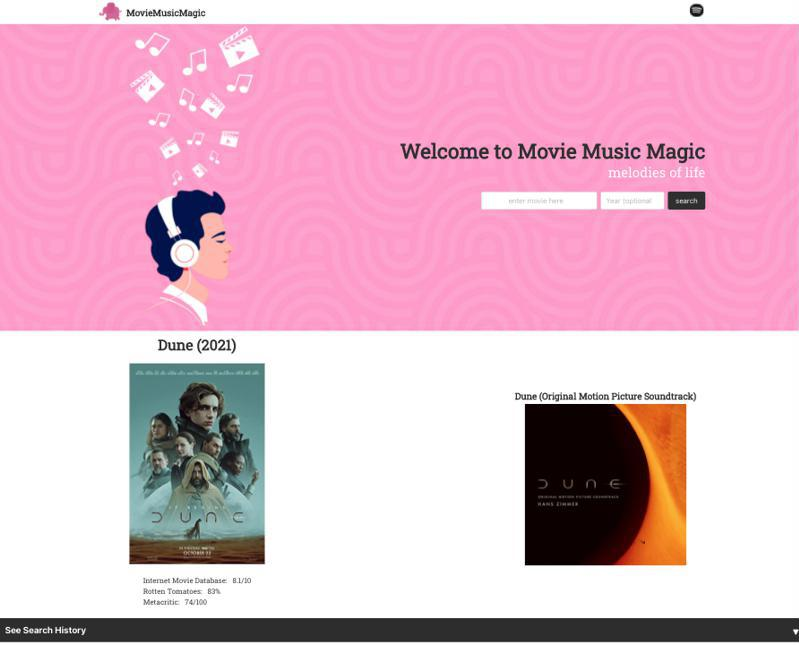

# <Your-Project-Title>MovieMusicMagic - Listen to Movie Soundtracks
## U of T Coding Boot Camp: Project 1 
### [Description](#description)  - [User Story](#user-story)  -  [Our Process](#our-process)  - [Technologies Used](#technologies-used)  - [Snapshots](#snapshots)  - [Deployment](#snapshots)  - [Installation](#installation)  - [Usage](#usage)  - [Credits](#credits)  - [License](#license) - [Features](#features)
&nbsp;
## Description

Movie Music Magic is an attempt to meet the needs of a particular niche market: people seeking high quality engaging music to create invigorating sound scapes for their work, study and relaxation while avoiding the distractions and irritations of huge platforms with advertisement based revenue strategies.
The application provides a user with a clean and attractive interface, a couple simple search inputs and a simple way to return to past results.

## User Story

```
AS A movie enthuiast
I WANT to have the ability to effortlessly search for movie soundtracks
SO THAT I can listen to and appreciate the musical scores of my favorite movies.
```

## Our Process:
- After receiveing the group assignment we met at the earliest convenient time and discussed our philosophy toward completing the project.
- We would each take two days to investigate APIs and possible opportunities for our application.
- A number of ideas were ultimately shelved in favour of Movie Music Magic (MMM) because it seemed to meet all of the criteria for the project and satisfied at least the basic needs of every group member.
- The team was sub-divided into two teams, one for HTML and CSS and another for JavaScript.
- The teams moved forward independently without having established a specific and detailed wireframe which later proved to be an impediment to development.
- In the teams, we practiced pair coding and git development best practices like creating feature and bug branches off of a develop branch.
- When the teams came back together, integration of the code and preparedness for continuiung development was out-of-step making continuing independent evolution more challenging.
- Even though team members faced some significant personal challenges to participation in the project, morale was kept up and each of the projects specific deliverables were accomplished.
- We remain enthusiastic about the specific inspiration for the project and look forward to implementing enhancements, including:
    - Browsing by genres
    - Spotify account integration
    - Intelligent search features

## Technologies Used

- HTML, CSS, Javascript
- Bulma
- Spotify API
- OMDb API
- Trello
- Slack
- Zoom

## Snapshots

### Search Results Page




### Search History Page


## Deployment 

To view the project's repository in GitHub, click [here](https://github.com/H0RSESH0E/movieMusicMagic).

To view the deployed application with the GitHub pages link, click [here](https://h0rsesh0e.github.io/movieMusicMagic/).

## Installation
To set up the website:
 - upload the index.html, style.css and script.js file along with the assets folder and all of its contents to the host server. 
 
## Usage
Use this webpage to learn more about your favourite Movies and TV shows.

See it online now at: [https://h0rsesh0e.github.io/movieMusicMagic/]

## Credits
This is our first group project in the Coding Boot Camp provided by [The School of Continuing Studies, University of Toronto](https://learn.utoronto.ca/) and [Trilogy Education Services](https://www.trilogyed.com/). Thanks to Chris, German and Adam for all of their help during this project. 

## License
All content excluding typefaces, registered trade marks and licensed components of the hero image are the exclusive property of The Pink Elephants and or Tirlogy Education Services and or The School of Continuing Studies, University of Toronto.

## Features
Movie Music Magic features a unique and user-friendly interface for a quick and easy search of your favorite movie soundtrack. 


